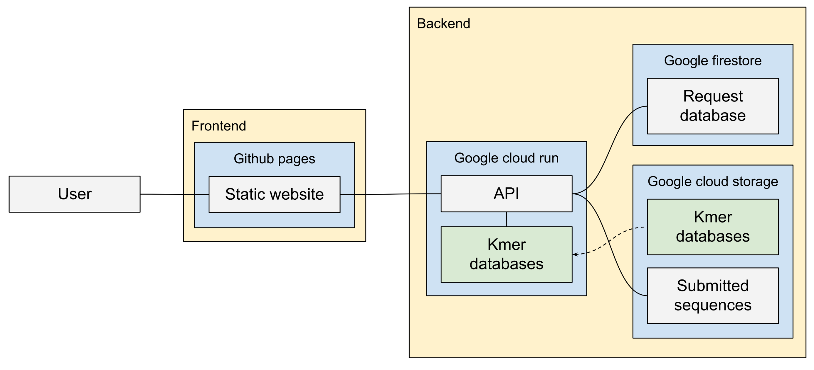

# Lab in a Backpack

Lab in a Backpack is a rapid pathogen sequencing and identification workflow. 
This repository contains the code for the cloud-based identification tool.

---
**Contents**

- [Intro](#intro)
- [Backend](#backend)
- [Frontend](#frontend)
- [How-to](#how-to)
---

## Intro

Lab in a Backpack uses GitHub Actions as a continuous development system. 
That means that updating the code in the repository automatically trigger the update and redeployment of the services that comprise AquaPath. 
After updating code or content the new changes will be live in a couple of minutes. 

Lab in a Backpack is comprised of two sub-systems. 
A web-based frontend that provides information about the tool and serves as a user interface. 
The backend is formed by an R based API deployed in Google Cloud Services infrastructure. 

## Backend

The backbone of Lab in a Backpack's backend is formed by an R based API. 
This RESTFUL API is deployed as a serverless service in Google Cloud Run. 

All the code for this service is stored in the [api](api) directory.

The API is built using [plumber](https://www.rplumber.io/) API generation tool for R. 
The api is encapsulated in a [docker container](https://www.docker.com/resources/what-container). 
This container contains almost everything (code, runtime, system tools, libraries and settings) needed to run the API in Google Cloud Run. 

The docker container executes the (api.R)[api/api.R] script. 
This script loads the configurations, connects to the kmer databases for each classifier, and initialises the plumber endpoints. 

### Endpoints

The API endpoints are defined in the [plumber.R](api/plumber.R) file.
The Swagger documentation for the API can be accessed via [https://rappseq-api-zrvf6kau3q-de.a.run.app/__docs__/](https://rappseq-api-zrvf6kau3q-de.a.run.app/__docs__/s) 

#### Identification endpoint

The `/identification` endpoint accepts POST requests and accepts the fastq files containing the sequences as well as other metadata sent with the request. 
This endpoint returns a JSON message with the request-id once the identification is completed. 
The results of the identification can then be accessed using the `/results` endpoint using this request-id. 

When an identification request is received the API: 

- Creates a unique ID for the request and the sequence file received
- Stores the request information in the Google firestore request database
- Saves the submitted sequence file in the Google cloud storage bucket 
- Finds matches for each classifier requested
 - If the matching has already been done in this file, retrieves previous results from the Google firestore request database
 - Otherwise:
 - Extracts the kmers from the sequence file
 - Looks for matches in the corresponding kmer database for the classifier
- Stores the matching results in the Google firestore request database
- Returns the request ID as a JSON payload

#### Results endpoint

The `/results` endpoint accepts GET requests and accepts the request ids of an existing request. 
It returns a JSON object containing information about the request and the matching results. 

When a results request is received the API:

- Consults the existing results in the Google firestore request database
- Returns the data obtained from the database as a JSON object 

### Continuous development / deployment

The API deployment workflow is defined in [.github/workflows/deploy.api](.github/workflows/deploy-api.yml). 
This workflow is set up to be triggered when changes to the API code or the workflow itself are made. 

Github Actions then carries all the jobs defined in the workflow and automatically deploys an updated version of the API in Google Cloud Run. 
The workflow: 

- Setups the Google Software Development Kit.
- Saves the Service Account Key into a file. This enables the API to connect to Google Cloud Services without requiring a password. 
- Retrieves the kmer databases from the Google Cloud Storage Bucket
- Build the docker image. This packages the code, the Service Account Key and the kmer databases into a single stand-alone executable file. 
- Deploys the docker image into Google Cloud Run

### Runtime

Google Cloud Run uses the docker image created during the continuous development workflow to create a container where the API runs. 
Google Cloud Run is a [Serverless cloud service](https://en.wikipedia.org/wiki/Serverless_computing), therefore containers are automatically scaled up and down as the API receives requests. 
Google Cloud Run only charges when the API is running to respond to a request.

### Data

Data for the application is stored in Google Storage and Google Firestore. 

- Kmer databases are stored in https://console.cloud.google.com/storage/browser/rappseq-data-1/classifiers/GBS
- Sequences uploaded as part of requests are stored in https://console.cloud.google.com/storage/browser/rappseq-data-1/request-sequences
- Data about the requests and classification results are stored in https://console.cloud.google.com/firestore/data/match_requests?project=rappseq

## Frontend

AquaPath front-end is built as a static website. 
This makes it fast and very cost-effective. 
As a development framework, we use Hugo. 

Two pages, one for identification and one to display the results use javascript code run on the browser to send requests to the backend API and render the received response. 

All the code and content for the front-end can be found in the [site](site) directory.

### Content

The contents of the front-end are coded in four different types of files). 

* Markdown files that can be found in the [site/content](site/content) directory. These include general pages on the website as well as pathogen profiles. 
* Hugos [configuration file](site/config.yaml)
* HTML [layouts](site/themes/rappseq/layouts) in the "rappseq" theme
* Javascript-based templates in the "rappseq" theme assets. These are used to dynamically display the responses of API requests to the backend. 

Modifying the Markdown-based content of AquaPath does not require any specialised knowledge. 
This can be done by creating or editing markdown files in the [site/content](site/content) directory; either from a local copy of the repository or directly from the GitHub web interface. 

Modifying all other content of AquaPath, including the landing page, the identification and results page as well as aesthetic changes to the website requires working (but basic) knowledge of HTML, (S)CSS, and JavaScript. 
Knowledge of Hugo or go templating, in general, is also helpful. 

### Design

Lab in a Backpack is based on the Frontv3 bootstrap template. 
As Lab in a Backpack uses Hugo, changes to the design theme should be made in the HTML [layouts](site/themes/rappseq/layouts) templates.

### Identification

The identification page has a form that, once completed, is submitted to the backend API using a fetch POST request to the identity endpoint. 
The javascript code used is in [site/assets/js/identify.js](site/assets/js/identify.js)

### Results

The results page submits a GET request to the API in the results endpoint as soon as the page is loaded. 
The request is based on the browser address. 
The response is then rendered using the [json2html](https://www.json2html.com) library. 

The javascript code is in [site/assets/js/results.js](site/assets/js/results.js) and the template is defined in [site/assets/js/results-template.js](site/assets/js/results-template.js).

### Continuous development

The site deployment workflow is defined in [.github/workflows/build-hugo-site.api](.github/workflows/deploy-api.yml). 
This workflow is set up to be triggered when changes to the site code or the workflow itself are made. 

Github Actions then carries all the jobs defined in the workflow and automatically deploys an updated version of the API in Google Cloud Run. 
The workflow: 

- Setups Hugo.
- Setups node.js
- Setups the npm dependencies 
- Builds the site
- Deploys the site using GitHub pages

## How-to

- **How to edit content from one of the text-based (markdown) pages?** Find the markdown file corresponding to the page you want to modify in the [site/content](site/content) directory. Edit the text in Github and commit the changes in the main branch.
- **How to edit content from the main page?** This text is encoded in the yml frontmatter of [site/content/_index.md](site/content/_index.md). Edit the text in Github and commit the changes in the main branch.
- **How to edit content from other pages?** The easiest might be to use the GitHub search bar to find the file with the text you want to change. Edit the text in Github and commit the changes in the main branch.
- **How to add a new classifier?** Add the SQLite file with the kmer database to the [Google storage bucket](https://console.cloud.google.com/storage/browser/rappseq-data-1/classifiers/GBS). Then register the classifier by editing (api/classifiers.yml) and following the pattern of existing classifiers.

